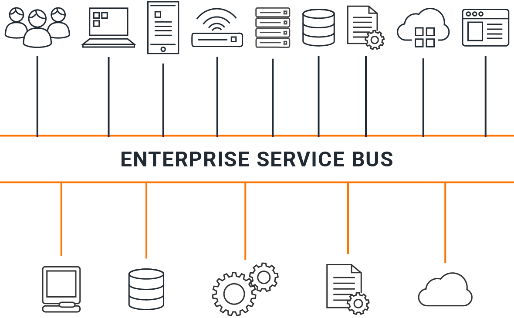
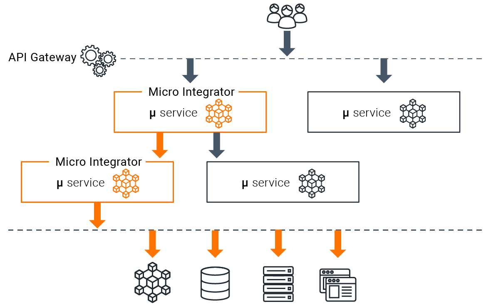

# JOIN DIM-MI

JOIN DIM-MI is the integration runtime based of [WSO2 Enterprise Integrator
(EI)](https://wso2.com/enterprise-integrator/) 

The DIM-MI runtime is lightweight, fast, scalable, and supports centralized ESB-style integration architectures as well as decentralized microservices architectures:

-   Centralized integration architecture
  

-   Decentralized integration architecture
  

## Why DIM?

The DIM ( Data in Motion ) provides developers with a flawless experience in developing, testing, and deploying integration solutions. The DIM MI developer experience is especially tuned for;
-   Integration developers who prefer a config-driven approach to integration (centralized or decentralized).
-   Integration developers who are looking for a solution to integrate brownfield (i.e.  legacy systems) solutions with new microservices-based solutions.
-   Existing EI and integration middleware users who want to move into cloud-native or microservices architectures.

## License

JOIN DIM-MI is licensed under the [Apache License](http://www.apache.org/licenses/LICENSE-2.0).

## Copyright
(c) 2024, [JOIN API.](http://www.joinapi.io) All Rights Reserved.
